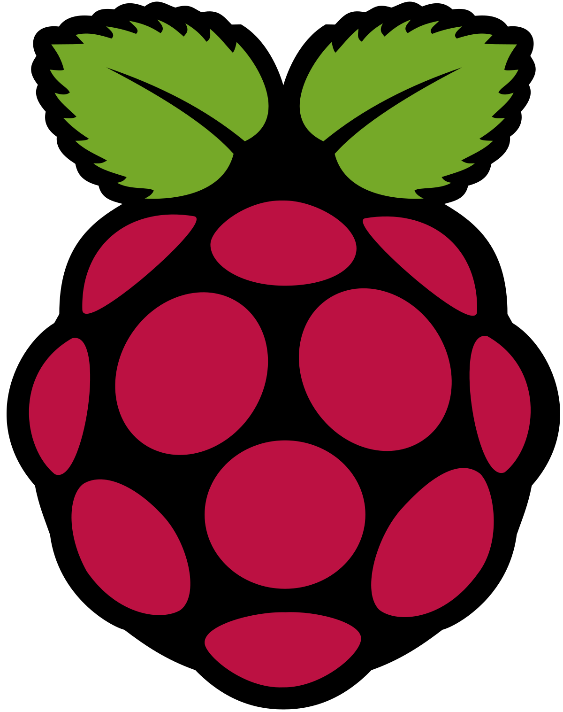
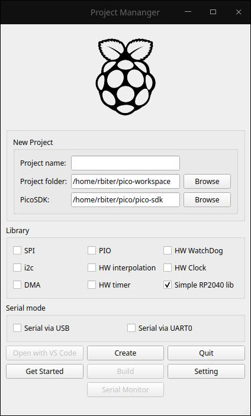
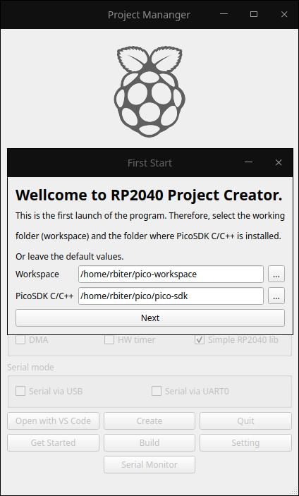

<br/>
<p align="center">
  <a href="https://github.com/3DThing/RP-2040ProjectGenerator">
    
  </a>

  <h3 align="center">RP-2040ProjectGenerator</h3>

  <p align="center">
    Simple project generator for Raspberry Pi Pico and RP2040 in C++/Qt6
    <br/>
    <br/>
    <a href="https://github.com/3DThing/RP-2040ProjectGenerator"><strong>Explore the docs »</strong></a>
    <br/>
    <br/>
    <a href="https://github.com/3DThing/RP-2040ProjectGenerator">View Demo</a>
    .
    <a href="https://github.com/3DThing/RP-2040ProjectGenerator/issues">Report Bug</a>
    .
    <a href="https://github.com/3DThing/RP-2040ProjectGenerator/issues">Request Feature</a>
  </p>
</p>

      

## Table Of Contents

* [About the Project](#about-the-project)
* [Built With](#built-with)
* [Getting Started](#getting-started)
  * [Prerequisites](#prerequisites)
  * [Installation](#installation)
* [Usage](#usage)
* [Roadmap](#roadmap)
* [Contributing](#contributing)
* [Authors](#authors)
* [Acknowledgements](#acknowledgements)

## About The Project



I do not even know where to start. In January 2021, the new RP2040 microcontroller was released. Everything would be fine, but against the backdrop of the problem of semiconductors and the shortage of STM32, this microcontroller attracts a lot of attention. Getting to know each other better. Found that he has a high entry threshold for writing C++ code. Compatible with arduino, but many functions do not work as they should. The creators of the chip made a project generator, but it does not work either (although this may be my long-standing feud with python). Installing PicoSDK and what to do with it then also creates a number of problems. Therefore, I came up with the idea to make my own project generator with blackjack and slutty girls, but you can download and use it at your discretion.

## Built With

Hardware parth:
IDE - Visual Studio Code
SDK - Pico SDK
Software parth:
QT-Creator
And Qt6 framework.

## Getting Started

In progress

### Prerequisites

In progress

In progress

This is an example of how to list things you need to use the software and how to install them.

* npm

```sh
npm install npm@latest -g
```

### Installation

In progress

1. Get a free API Key at [https://example.com](https://example.com)

2. Clone the repo

```sh
git clone https://github.com/your_username_/Project-Name.git
```

3. Install NPM packages

```sh
npm install
```

4. Enter your API in `config.js`

```JS
const API_KEY = 'ENTER YOUR API';
```

## Usage



Just run the executable.

A window with the initial settings will open where you will be prompted to select the path for the working folder and the path to the Pico-SDK. Then you can use the project. To create a project, enter a project name and click the Create button. After that, you can open the project in Visual Studio Code or edit the code directly in the folder in any text editor and build the application using the Build button.
To open an existing project, just enter the name of the project, the project will open automatically.

## Roadmap

Ready:
Project creation.
Compiling the project.
Loading a project in VS Code.
Linking libraries (not final version).
Own libraries for working with I / O ports as well as timer interrupts (similar to Arduino). Read more...

In the plans:
Implementation of a serial monitor.
Development of their libraries.
Develop your own code editor or IDE.

## Contributing

If you want to offer ideas for improvement, help with code, testing, etc. You can write me telegram @lucifer364 or email rbiter@yandex.ru

### Creating A Pull Request


## Authors

* **Rbiter** - *Vlad Valter* - [Rbiter](https://github.com/3DThing) - *github*
